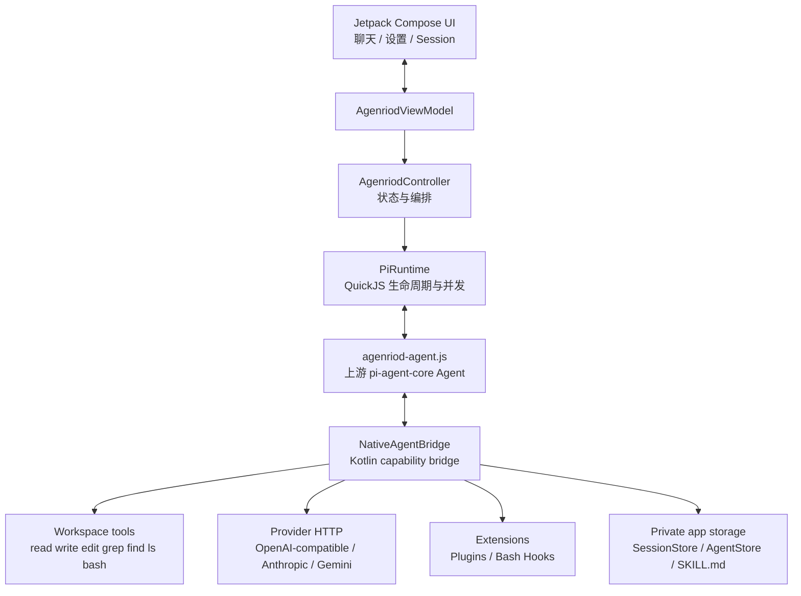

# Agenriod

Agenriod 是一个在 Android 设备本地运行的 Agent 前端。它使用 Jetpack Compose 提供界面，把 Android 文件、进程、网络和系统输入能力通过 Kotlin bridge 暴露给 QuickJS 中的 Pi Agent。

当前实现基于上游 `@earendil-works/pi-agent-core` 的 Agent 循环。上游项目把 Agent runtime 和工具执行分成了可组合的层；Agenriod 保留 Agent 循环、工具调用、消息和生命周期事件的契约，再用 Android 能力替换 Node.js 的文件系统和进程实现。

## 架构总览



一次消息的主要路径是：

1. `MainActivity` 把输入框中的 `TextFieldValue` 和操作事件交给 `AgenriodController`。
2. Controller 校验当前 Session 和输入法组合态，必要时展开 `/skill` 或 `@plugin` 快捷命令。
3. `PiRuntime` 在后台 dispatcher 中串行访问 QuickJS，并调用 `__agenriod_prompt`。
4. JS 中的 `Agent` 按 Pi 的循环执行模型请求和工具调用。每一个生命周期事件都带有 `sessionId` 返回 Kotlin。
5. `NativeAgentBridge` 执行文件、shell、Plugin 或 Hook 操作；模型请求也由 bridge 转成供应商 HTTP 请求。
6. Controller 把事件归约成 UI 消息，同时保存原始 Pi transcript 和可读的显示消息。

## 目录和职责

```text
app/src/main/java/com/example/agenriod/
├── MainActivity.kt                  # Compose 入口和页面路由
├── agent/
│   ├── AgentModels.kt               # UI、模型、Plugin、Skill、Session 数据模型
│   ├── AgenriodViewModel.kt         # Activity 重建时保留 Controller
│   ├── AgenriodController.kt        # 单向状态、Session、快捷命令和事件归约
│   ├── PiRuntime.kt                  # QuickJS 实例、JS asset 加载、请求串行化
│   ├── NativeAgentBridge.kt          # Android 文件/进程/HTTP/扩展能力
│   ├── AgentStore.kt                 # 模型设置和 Keystore 加密 API key
│   ├── SessionStore.kt               # 本地 Session 文件读写
│   └── SkillCatalog.kt               # SKILL.md 发现和解析
└── ui/
    ├── CompactComposer.kt            # 单行输入栏、中文 IME、语音/图片入口
    ├── ComposerShortcuts.kt          # 按光标位置计算 @ 和 / 补全
    └── theme/                        # Agenriod 颜色、字体和主题

app/src/main/assets/
├── agenriod-agent.js                # 构建生成的 Pi runtime bundle
└── skills/*/SKILL.md                # 内置 Skill prompt

runtime/
├── src/agent-runtime.js              # JS 侧 Agent、工具 schema 和 provider bridge
├── build.mjs                         # esbuild bundle 脚本和 QuickJS polyfill
├── package.json
└── package-lock.json
```

## Android UI 层

`MainActivity` 只负责组装 Compose 页面和 Activity 级资源。实际状态由 `AgenriodViewModel` 持有 Controller，因此旋转屏幕或 Activity 重建不会创建新的 Agent 会话。

聊天页包含：

- `CompactComposer`：单行 `BasicTextField`，保留中文拼音的 composing range；输入法提示语言为 `zh-CN,en-US`。
- `@` Plugin 和 `/` Skill 补全：补全只替换光标所在的当前词，不会覆盖前后文本。
- 内联 `SpeechRecognizer` 麦克风按钮；语音结果默认按普通话识别。
- 图片选择入口；图片以 base64 image content block 交给模型。
- 可展开的工具执行卡片和可选择文本的 Agent 回复。

设置页分为 Model、Plugins、Hooks 三个页面。Session 页负责新建、切换、重命名和删除会话。

## Pi runtime 层

`runtime/src/agent-runtime.js` 使用上游 `Agent` 和 `AssistantMessageEventStream`。它不直接访问 Android 或 Node API，只调用两个 host binding：

```text
__agenriod_call(method, payload)
__agenriod_call_async(method, payload)
```

JS 侧创建 Pi 风格的 `read`、`write`、`edit`、`grep`、`find`、`ls`、`bash` 工具。工具参数使用 TypeBox schema，执行结果使用 Pi 的 text/image content 结构。

QuickJS 没有浏览器标准库，因此 `build.mjs` 在 bundle 前添加了 `TextEncoder`、`TextDecoder`、`URL`、`AbortController`、`structuredClone` 等最小兼容实现。网络和文件 I/O 仍然全部在 Kotlin 完成。

## Kotlin capability bridge

`NativeAgentBridge` 是 JS runtime 和 Android 的唯一能力边界。它通过 method name 分派调用：

| 方法 | 作用 |
| --- | --- |
| `read` | 读取 UTF-8 文本或常见图片类型，支持 offset/limit |
| `write` | 创建父目录并写入文件 |
| `edit` | 替换恰好一次出现的文本 |
| `grep` | regex/literal、大小写、glob、上下文行和匹配上限 |
| `find` / `ls` | 枚举 workspace 文件 |
| `bash` | 在 workspace 使用 `/system/bin/sh` 执行命令，并限制超时和输出 |
| `complete` | 将统一的模型上下文转成供应商 HTTP 请求 |
| `plugin` | 执行 Plugin manifest 中声明的命令 |
| `hook` | 在工具前后运行配置的 Hook 命令 |
| `event` | 把 Pi 生命周期事件送回 Controller |
| `plugins` | 读取已安装 Plugin manifest |

文件路径先经过 `normalize` 和 workspace 前缀检查，不能访问 app-private workspace 以外的路径。workspace 位于：

```text
<app files>/workspace
```

## 模型请求

设置页中的 `provider`、`baseUrl`、`model`、`apiKey` 和 `systemPrompt` 由 `ModelConfig` 表示。

- `openai-compatible`：发送到 `POST /chat/completions`，兼容 OpenAI、OpenRouter 和本地 BYOK gateway。
- `anthropic`：发送到 `POST /messages`，使用 Anthropic headers 和 content block 格式。
- `gemini`：发送到 Gemini `:generateContent`，使用 API key query、`inlineData` 图片和 function calling。

当前 provider adapter 请求一次返回完整响应，然后在 JS 中转换成 Pi 的 `AssistantMessageEventStream` 事件。因此 Agent 的工具递归和生命周期事件保持可用，但网络层还不是逐 token streaming。

API key 只保存在 app-private preferences 中的 Keystore 加密字段。请求只发往用户配置的 endpoint；代码不会把 key 写入 Session transcript、Hook 环境变量或 Plugin 参数。

## Plugin

Plugin 是 app-private `plugins` 目录中的 JSON manifest。设置页可以安装示例或粘贴 manifest，也可以删除已安装 Plugin。

```json
{
  "id": "workspace-info",
  "name": "Workspace Info",
  "description": "Inspect files in the current workspace",
  "tools": [
    {
      "name": "list",
      "description": "List workspace files",
      "parameters": {"type": "object", "properties": {}},
      "command": "ls -la"
    }
  ]
}
```

加载后，工具名会变为 `plugin_<plugin-id>_<tool-name>`，并加入下一次 Agent runtime 配置。命令在 workspace 中执行，可读取：

```text
PLUGIN_ARGS_JSON   # 当前工具参数 JSON
AGENT_WORKSPACE    # workspace 的绝对路径
```

在聊天中输入 `@` 会从已加载的 manifest 生成候选，选中后插入稳定的 Plugin id；Controller 会在发给 Agent 的请求中说明要使用该 Plugin。

## Hooks

Hooks 在设置页中每行一个，格式为：

```text
before_tool|command
after_tool|command
```

Hook 命令可读取：

```text
AGENT_EVENT
AGENT_TOOL
AGENT_ARGS_JSON
```

`before_tool` 返回非零状态会阻止工具调用；`after_tool` 只记录观察结果。Android 没有系统 GNU Bash，当前实现使用 `/system/bin/sh`，因此支持常用 shell 命令，但不是随 APK 分发的完整 Bash。

## Skill

`SkillCatalog` 首先加载 APK 内置的 `assets/skills/*/SKILL.md`，再加载 app-private 目录中的定义：

```text
<app files>/skills/*/SKILL.md
<app files>/workspace/.pi/skills/*/SKILL.md
```

同名本地 Skill 会覆盖内置 Skill。`/` 补全展示 Skill 的 `name` 和 `description`，发送时把其正文作为 Agent instruction，并保留用户的实际任务。

## Session 和持久化

每个 Session 对应 `files/sessions/<session-id>.json`，包括：

- `uiMessages`：聊天页需要显示的消息和工具状态。
- `rawMessages`：可再次传给 Pi Agent 的原始 user/assistant/toolResult transcript。
- `title` 和 `updatedAt`：Session 列表的显示信息。

切换 Session 时，Controller 会先中断当前 runtime，再使用目标 Session 的 `rawMessages` 创建新的 Pi Agent。每个 JS 事件带有 session id，旧 runtime 的延迟事件会被忽略。

## 构建流程

```text
npm ci --prefix runtime
        │
        ▼
node runtime/build.mjs
        │
        ▼
app/src/main/assets/agenriod-agent.js
        │
        ▼
./scripts/android.sh build / run
```

`scripts/android.sh build` 和 `run` 会自动执行 runtime bundle。Android 脚本还负责定位 SDK、选择 `Pixel_8a`、构建、安装和启动应用。

常用命令：

```bash
./scripts/android.sh doctor
./scripts/android.sh build
./scripts/android.sh run
./scripts/android.sh logs -d
./scripts/android.sh crashes
./scripts/android.sh screenshot
./scripts/android.sh ui
./scripts/android.sh gradle :app:testDebugUnitTest
./scripts/android.sh gradle :app:lintDebug
./scripts/android.sh gradle :app:connectedDebugAndroidTest
```

## 测试边界

已有测试覆盖：

- `ComposerShortcutsTest`：按光标位置替换 Plugin/Skill 快捷词。
- `CompactComposerTest`：中文 composing range、中文提交、单行高度和按钮宽度。
- `SessionStoreTest`：Session 隔离、Pi transcript 恢复和挂起模型请求中断。
- `ExampleInstrumentedTest`：Android Keystore API key 回环。
- `ExampleUnitTest`：基础 JVM 单元测试。

这些测试验证本地 Agent、输入和存储边界。它们不会用真实 API key 发起模型请求；真实 provider 的可用性仍取决于 endpoint、model id、账号权限和设备网络。

## 已知边界和后续方向

以下是当前实现的事实，不是已经完成的功能：

1. 网络响应目前是整段返回后再转成 Pi stream，没有逐 token provider streaming。
2. Shell 执行器是 Android `/system/bin/sh`，还没有内置完整 GNU Bash。
3. workspace 默认是 app-private 目录，还没有通过 Storage Access Framework 选择外部代码仓库。
4. Plugin 当前是受控 JSON manifest + shell command 扩展点，还没有加载任意 TypeScript 插件包。
5. 语音输入依赖系统 SpeechRecognizer 和用户设备上的中文输入法/语音服务。
