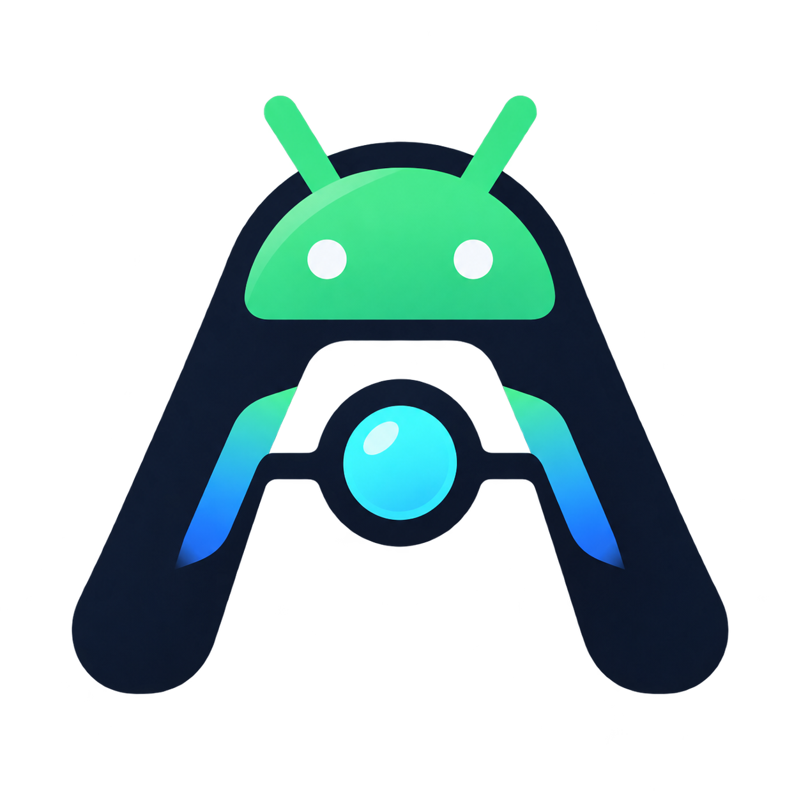

<p align="center">
  
</p>

<h1 align="center">AgentOS</h1>

AgentOS 将 Agent 作为 Android 系统组件运行。Agent 由系统启动和监管，拥有自己的进程、持久化状态、权限边界和输出事件流；Android App 只是前端，可以创建 Session、提交输入和订阅输出。

当前仓库处于系统化迁移阶段。`frontends/agenriod` 保留旧 Agent Host 作为测试兼容代码；正常系统镜像路径由 `AgentManagerService` 和 `sideagentd` 提供 Session、事件和 Plugin 路由。Runtime、任务存储和模型执行仍需按版本打包到 `sideagentd`，否则系统会对提交任务返回 `runtime_unavailable`。

前端原型还提供了一个 Android 系统助理入口：将 Agenriod 设为默认数字助理后，设备支持的助理手势可以唤起 Siri 风格的 Compose surface。配置步骤、语音行为和电源键映射边界见 [`docs/assistant-frontend.md`](docs/assistant-frontend.md)。

## 目标架构

```text
Android init
└── sideagentd                         # 独立系统进程，Agent 数据面
    ├── Agent Runtime / QuickJS
    ├── Task Store / Session Store
    ├── Model Gateway
    ├── Capability Broker
    ├── Plugin Sessions
    └── Output Event Bus

system_server
└── AgentManagerService                  # 系统控制面
    ├── 管理 sideagentd 生命周期
    ├── 管理用户、权限和前端连接
    ├── 校验 Plugin 身份
    └── 暴露稳定 AIDL

System UI / Voice / 任意 App
└── Agent Frontend Client                 # 输入、订阅、渲染

第三方 App
└── AgentPluginService                    # Plugin 在自己的 UID 中执行
```

`system_server` 只负责系统契约、权限和路由，不执行模型循环、QuickJS、网络请求或第三方 Plugin 代码。`sideagentd` 使用专用 UID 和 SELinux domain，由 `init` 启动；它崩溃时由系统重启，状态从任务存储和事件日志恢复。

## 远期目标

Agent 的目标形态是一个由系统启动、监管和恢复的系统服务与常驻进程。它不属于某个 Activity、前台服务或普通 App；前端可以退出、切换或重连，而 Agent 的 Session、任务和事件事实仍由系统侧持有。

Plugin 的目标形态是 App 运行时向 Agent 系统进程注入的运行时变量和受控能力声明。Plugin 的代码继续运行在提供它的 App UID 和进程中，Agent 只接收经过身份、签名、权限和 capability policy 校验的描述、参数和调用结果，不把第三方代码加载进 `system_server` 或 `sideagentd`。

这里最难的部分不是把 Agent 进程常驻起来，而是 Session 调度：系统需要在多个用户、前端、Session、Plugin capability 和 Agent worker 之间分配执行机会，处理优先级、公平性、取消、超时、背压、前端断线、Plugin 进程死亡和 daemon 重启后的恢复。后续接口和存储设计应优先服务于这个调度模型，而不是把 Session 当成某个前端的临时对象。

## 输出管道

Agent 的事实来源是系统侧 Session 和事件日志，不是某个 Activity 的内存状态。前端通过 AgentManagerService 订阅事件：

```text
createSession(userId, frontendId)
submitInput(sessionId, requestId, input)
submitAutoInput(userId, requestId, input)   # sideagentd 选择已有/最近冷 Session 或新建
subscribeOutput(sessionId, afterSequence)
cancelTask(requestId)
getSnapshot(sessionId)
```

输出事件至少包含 `sessionId`、`taskId`、`requestId`、`sequence`、`eventType`、`payload` 和 `timestamp`。跨 App 的第一版管道使用系统 Binder 返回的只读 `ParcelFileDescriptor`，事件以长度前缀的 UTF-8 JSON frame 传递；前端断线后按序号恢复，不需要重新创建 Agent。慢读端只会丢失当前订阅，不能阻塞 Agent；前端通过 snapshot + sequence 补齐事件。

## 目录

```text
frontends/agenriod/       当前 Compose 前端和迁移中的兼容实现
system/agent/             sideagentd、Agent Bus、启动和运行时设计
platform/framework/       system_server 的 AgentManagerService 设计
platform/product/         系统签名、产品包和权限配置占位
platform/aosp-integration AOSP 产品接入、init、SELinux 和构建说明
platform/checkout/        AOSP repo checkout 占位目录，不纳入本仓库
plugins/api/              Plugin AIDL 与协议契约
plugins/notes/            跨 App Notes Plugin 示例
plugins/catalog/          Plugin 开发约定和示例清单
libraries/file-broker/    Android 文件能力适配器
libraries/mcp-client/     Streamable HTTP MCP 客户端
runtime/                  Agent JS 参考实现和 Node 契约测试
system/agent/daemon/      sideagentd Scheduler、Session Store 和 Worker 参考实现
tools/android/            本地 Android 构建、设备测试和调试脚本
docs/                     架构、迁移和开发文档
```

Pi 的 ACP v1 stdio 适配器见 [`docs/acp-pi-adapter.md`](docs/acp-pi-adapter.md)。

## 当前实现与目标的关系

当前 Android 原型中的 `AgentHost`、`PiRuntime`、Session 事件归约、MCP 协议和 Plugin Binder 契约会被保留为迁移素材。`AgentService`、app-private 任务队列、Activity 内的 UI 状态和本地 shell Plugin 不是最终系统架构。

系统迁移需要把这些职责移到 `sideagentd`：

- 任务和 Session 使用 SQLite/WAL 或等价的事件日志，支持崩溃恢复、序列号和幂等键；
- Runtime 通过 Capability Broker 访问文件、网络、系统能力和 Plugin；
- Plugin 由 PackageManager、UID、签名和系统权限共同校验；
- App 只持有前端订阅和临时显示状态；
- 高风险工具在系统策略和用户授权下执行，Agent 输出不能直接改变系统权限。

## 开发命令

```bash
./tools/android/android.sh doctor
./tools/android/android.sh build
./tools/android/android.sh run
./tools/android/android.sh gradle :frontends:agenriod:testDebugUnitTest
./tools/android/android.sh gradle :frontends:agenriod:lintDebug
./tools/android/android.sh instrumentation

npm ci --prefix runtime
node runtime/build.mjs
node runtime/plugin-contract-test.mjs
node runtime/runtime-plugin-test.mjs
npm run test:acp --prefix runtime
npm run test:scheduler --prefix runtime
```

Android 原型的设备测试仍使用本地 `Pixel_8a` AVD。系统组件的编译和 Cuttlefish 验证会在 `platform/checkout` 可用后加入 CI 矩阵。

## 迁移阶段

1. 冻结现有 App 原型，并定义稳定 AIDL、事件流和任务状态协议。
2. 创建最小 `sideagentd`，通过 `init` 启动并注册 Binder 服务。
3. 加入专用 UID、SELinux domain、数据目录和 `dumpsys agent` 诊断入口。
4. 在 `system_server` 实现 AgentManagerService，连接并恢复 sideagentd。
5. 将 System UI 和现有 Agenriod App 改成 Agent 前端。
6. 迁移 Task Store、Session Store、Pi Runtime 和 Plugin Broker。
7. 移除 App 内 Agent 宿主，只保留前端和兼容测试。

每个阶段都必须能独立启动、检查和回滚。系统接口的设计文档见 [system-architecture.md](docs/system-architecture.md)，前端和系统之间的逻辑协议见 [agent-bus-v1.md](system/agent/contracts/agent-bus-v1.md)，Session 调度契约见 [session-scheduling-v1.md](system/agent/contracts/session-scheduling-v1.md)，自动选择契约见 [session-selection-v1.md](system/agent/contracts/session-selection-v1.md)，迁移清单见 [migration-roadmap.md](docs/migration-roadmap.md)。

默认 CI 只运行离线目录检查、Node 契约测试和按变更触发的 Android JVM/Lint 检查；它不会同步 AOSP、启动模拟器或构建系统镜像。平台镜像验证保留为后续手动 workflow。
