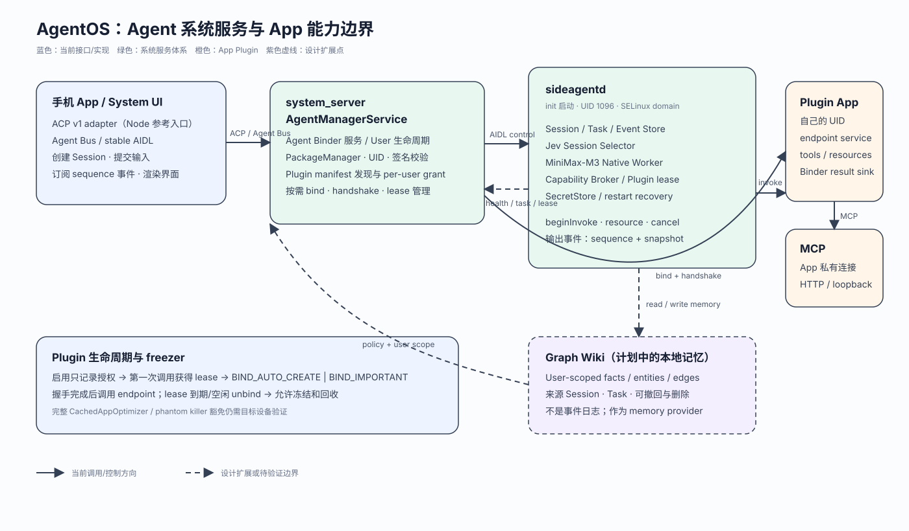

# AgentOS 架构：系统 Agent、App 能力和本地记忆

AgentOS 把 Agent 从手机 App 的生命周期里移到 Android 系统侧。App 负责输入和呈现，Agent 负责 Session、任务、事件和模型调用；App 的能力通过 Plugin 暴露给 Agent。两条边界方向相反：

- **App 调用 Agent**：客户端通过 ACP 语义访问 Agent 能力。当前仓库里的 Pi ACP v1 适配器位于 `runtime/src/acp-adapter.js`，是 Node 参考实现；Android 系统部署使用同一组 Agent Bus 语义的稳定 AIDL/Binder 接口，入口由 `AgentManagerService` 提供。
- **Agent 调用 App**：App 通过 Plugin endpoint 暴露工具和资源。Plugin 代码始终运行在 App 自己的 UID 和进程里，系统只转发经过身份、签名、用户授权和 capability policy 过滤的调用。Plugin 可以在自己的进程里使用 MCP 客户端访问本地或远端服务。

ACP 和 Plugin 处理的是两组不同的调用方向。ACP 描述 Agent 面向客户端的会话和事件；Plugin 描述 App 面向 Agent 的工具、资源和 MCP 配置。



## 1. Agent 是 Android 系统服务体系

Agent 的系统实现分成控制面和数据面：

| 部件 | 运行位置 | 负责什么 | 不能负责什么 |
| --- | --- | --- | --- |
| `AgentManagerService` | `system_server` | 发布系统 Binder 服务、处理 User 生命周期、校验 Plugin 身份、管理 per-user 启用状态、按需绑定 endpoint、把会话移交给 `sideagentd` | 不跑模型请求，不执行第三方 Plugin 代码，不保存模型循环 |
| `sideagentd` | `init` 启动的独立 native 进程，专用 UID 1096 和 SELinux domain | 保存 Session/Task/Event 状态，运行 native Worker，调用 Jev 和 MiniMax-M3，维护 capability lease，转发 Plugin tool/resource/cancel | 不把 Plugin 代码加载到自己的地址空间，不代替 `system_server` 做 PackageManager 权限决策 |
| 前端 App / System UI | 普通 App 或系统 UI 进程 | 通过 Agent Bus/AIDL 或 ACP 适配器创建 Session、提交输入、订阅事件和渲染界面 | 不拥有任务和事件日志的事实来源 |
| `system/agent/daemon` | Node 参考目录 | 验证 Scheduler、Store、Plugin Broker 和 Session 选择契约 | 与 Android 镜像里的 `sideagentd` 分开 |

`init` 负责启动和重启 `sideagentd`。`AgentManagerService` 在 `PHASE_ACTIVITY_MANAGER_READY` 后发布 `agentos` Binder 服务，并在 User start/stop/unlock 时扫描和清理 Plugin。系统侧的稳定接口位于 `platform/aosp-integration/overlay/system/agent/com/example/agentos/`；参考实现和契约分别位于 `system/agent/daemon/` 与 `system/agent/contracts/`。

“Agent 是一个系统服务”指的是由 `system_server` 控制、由 `sideagentd` 运行的系统服务体系。`system_server` 处理控制面，`sideagentd` 运行 Agent；模型网络请求、Session worker 和第三方能力调用因此离开系统服务主线程。

## 2. 手机 App 与 Agent：两条协议边界

### 2.1 App 通过 ACP / Agent Bus 使用 Agent

ACP v1 的职责是协商协议版本、创建 Agent Session、提交 prompt、接收消息和工具事件、请求权限、取消和关闭。`docs/acp-pi-adapter.md` 对当前实现做了明确限制：

- `initialize`、`session/new`、`session/prompt`、`session/cancel`、`session/close` 和 `authenticate` 已有参考实现；
- 文本、图片、资源链接和嵌入文本可以进入 prompt；
- `loadSession`、MCP transport、terminal delegation 和 filesystem delegation 当前不会被 ACP 适配器宣告；
- ACP 适配器不拥有 Android 身份、事件持久化、幂等键或重启恢复。

Android 系统路径把这些逻辑消息映射到 Agent Bus/AIDL。前端提交输入时，系统返回 durable enqueue receipt，后续输出通过带 `sequence` 的事件流传递。前端断线后以 Snapshot 加 `afterSequence` 恢复，不需要把 Session 重新建成 Activity 私有状态。

```text
Phone App / System UI
        │ ACP v1 adapter（当前 Node 参考入口）
        │ Agent Bus / stable AIDL（Android 系统入口）
        ▼
AgentManagerService ── createSession / submitInput / subscribe / cancel
        │
        ▼
sideagentd ── task queue / worker / event log / snapshot
```

### 2.2 Plugin 通过 endpoint 和 MCP 暴露 App 能力

Plugin 的 manifest endpoint 只承担发现锚点。能力事实来自运行时 descriptor。`AgentManagerService` 只接受满足这些条件的服务：

1. service exported，声明 `agentos.intent.action.PLUGIN_ENDPOINT`；
2. 持有 `com.example.agentos.permission.BIND_AGENT_PLUGIN`；
3. `agentos.plugin.id` 与包名一致；
4. PackageManager 返回的 UID、用户和签名与记录一致；
5. 运行时握手返回 protocol v3 descriptor，系统再从 descriptor 取 `tools` 和 `resources`。

能力调用的中转顺序是：

```text
sideagentd
  → AgentManagerService.acquireRuntimePlugin(userId, pluginId, leaseId)
  → bindServiceAsUser(endpoint)
  → openPluginSessionV2 / sessionGranted
  → sideagentd 保存 endpoint Binder 和 granted capability
  → beginInvoke / beginReadResource / cancelInvoke
  → App UID 中的 Plugin endpoint
  →（需要时）App 自己的 MCP client / MCP server
```

App 的 MCP 认证 header 和用户 credential 留在 App 或系统私有存储中，不进入 descriptor、事件日志或模型 prompt。`libraries/mcp-client` 是当前 Streamable HTTP 适配器；系统迁移完成后，MCP 连接由 `sideagentd` 的 capability policy 统一监管，前端只看到过滤后的工具摘要和事件。

## 3. freezer 与按需加载

启用 Plugin 只代表用户允许使用它，不代表马上启动 App 进程。当前控制面把两个时刻分开：

```text
scanUser / setPluginEnabled
        │ 记录 per-user grant，不绑定进程
        ▼
第一次需要 tool/resource
        │ acquireRuntimePlugin 创建 lease
        ▼
bindServiceAsUser(BIND_AUTO_CREATE | BIND_IMPORTANT)
        │ 拉起或解冻 endpoint，完成 v3 握手
        ▼
sideagentd 调用 capability
        │ lease 到期或空闲窗口结束
        ▼
unbind，允许 Android freezer / OOM 策略回收进程
```

当前代码中的两个时间边界是 `LEASE_MS = 60_000` 和 `IDLE_UNBIND_MS = 30_000`。绑定使用 `BIND_IMPORTANT | BIND_AUTO_CREATE`，目的是在有效 lease 或 in-flight 调用期间提高 endpoint 进程的存活优先级。这组 flag 不能提供 Android freezer 的全局豁免。`CachedAppOptimizer`、phantom process killer 和 Binder driver 的冻结事务仍需要在目标设备上单独验证，相关边界记录在 `platform/aosp-integration/aosp-todo.md`。

这个机制解释了“启用即绑定”和“按需唤起”的差别：前者在设置开关变化时启动 App，后者把启动动作放到 capability lease 的获取路径上。空闲 unbind 后，同一个 Plugin 下次会获得新的 `pluginSessionId` 和新的 `leaseId`，旧 lease 不能继续调用。

## 4. Jev 自动管理 Session，MiniMax-M3 执行任务

Jev 和 MiniMax-M3 在 Agent 运行时承担不同工作：

- Jev 只负责 Session 选择。输入未带 `sessionId` 时，`sideagentd` 按 `userId` 维护活跃 Session 候选池，把候选摘要编码为 Choice，请 Jev 返回一个合法的 `choiceId`；
- 选择结果通过 `session.selected` 事件记录。Jev 超时、鉴权失败、返回非法 id 或候选超出预算时，系统固定选择 `new_session`，并写入 `fallbackReason`；
- MiniMax-M3 Worker 负责当前 Task 的模型循环。它读取 Session 历史，向模型发送工具定义，收到 `tool_use` 后通过 capability broker 调用 Plugin，再把结果作为 `tool_result` 送回模型；
- API key 由 `SecretStore` 读取，不进入 `system_server`、事件 payload 或日志。Jev 的选择和 MiniMax 的执行都在 `sideagentd`，前端只订阅事件。

Session、Task、Attempt 和 Plugin lease 是不同对象。Session 提供上下文和事件序列，Task 表示一次用户输入，Attempt 表示一次执行尝试，lease 表示某次 worker generation 使用某个 Plugin capability 的授权。daemon 重启后，未确认 Attempt 标记为未知状态，系统不会因为进程重启自动重放外部副作用。

## 5. Graph Wiki：本地记忆的扩展点

当前仓库没有名为 Graph Wiki 的实现、模块或 Android service。现有 `SessionStore`、`TaskStore` 和事件日志承担任务事实存储，Graph Wiki 应作为后续的本地记忆 provider 接入。

建议的边界是：

- `sideagentd` 按 User 持有本地图谱，节点保存事实、偏好、项目和实体，边保存关系和来源；
- 每条记忆带 `userId`、来源 Session/Task、创建和更新时间、置信度、删除标记和版本；
- Agent 在新 Task 开始前按当前用户和 query 读取少量相关事实，把它们作为受限上下文传给模型；Task 完成后只写入经过策略过滤的事实，不把完整模型响应自动变成长期记忆；
- Plugin 和前端不能绕过 Agent 直接改图谱。写入必须有幂等键、用户授权和“忘记这条记忆”的删除路径；credential、认证 header 和未授权的 App 私有内容不能进入图谱。

Graph Wiki 与事件日志的关系也要保持清楚：事件日志是不可变的执行事实，Graph Wiki 是可修订的用户记忆索引。记忆删除不能篡改已经产生的任务事件，只能追加删除标记并让后续检索忽略对应节点。

## 6. 当前状态与阅读边界

| 主题 | 当前仓库事实 | 需要继续验证或实现 |
| --- | --- | --- |
| Agent 系统服务 | `AgentManagerService`、`sideagentd`、init、专用 UID 和 AIDL 已有 AOSP 接线 | 多用户 Session/lease 撤销、完整重启恢复矩阵 |
| ACP | `runtime/src/acp-adapter.js` 提供 Pi ACP v1 参考入口 | Android 前端到 ACP gateway 的正式产品接线，ACP 的 session resume/MCP delegation |
| Plugin + MCP | manifest 发现、v3 descriptor、按需 bind、lease 和 Binder 路由已有实现；MCP 客户端在迁移目录 | 完整设备端 tool/resource 回执、Binder death、freezer/phantom killer 矩阵 |
| Jev + MiniMax | native Worker 有 Jev Choice 选择和 MiniMax-M3 tool loop | 外部鉴权、网络和所有模型响应的设备验收 |
| Graph Wiki | 当前没有 Graph Wiki 实现 | 本地存储格式、检索策略、隐私和删除契约 |

架构文档的判断依据来自 `AgentManagerService.java`、`sideagentd/main.cpp`、`runtime_worker.cpp`、`session_selector.cpp`、`docs/acp-pi-adapter.md` 和 `system/agent/contracts/`。其中“当前状态”是代码和文档事实；Graph Wiki 和正式 ACP Android 入口属于设计方向，不能当成已经打包进镜像的功能。
